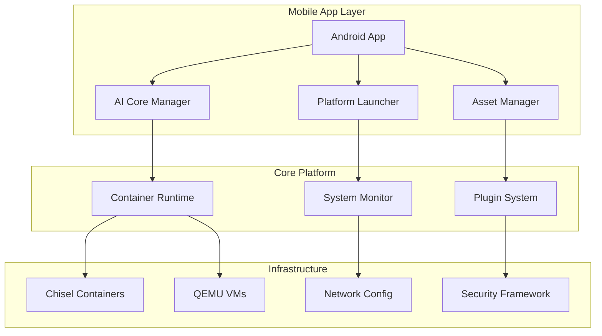

# FileSystemds Mobile Platform


[](https://github.com/spiralgang/FileSystemds/releases)
[](https://github.com/spiralgang/FileSystemds/blob/main/LICENSE.GPL2)

**Transform your mobile operations with the next-generation FileSystemds Mobile Platform - a modular, AI-driven orchestration system designed for modern mobile/cloud-first environments.**

---

## 📱 Download Latest APK

<div align="center">

### 🚀 Get the App Now!

[](https://github.com/spiralgang/FileSystemds/releases/latest/download/filesystemds-mobile-release.apk)

[](https://github.com/spiralgang/FileSystemds/actions/workflows/android-apk-build.yml)

</div>

### 📲 Installation Instructions

1. **Download** the APK using the button above
2. **Enable** "Unknown Sources" in your Android settings
3. **Install** the APK file
4. **Launch** FileSystemds Mobile Platform

> **Note**: The APK is automatically built and signed with every code change. Debug builds are available from the GitHub Actions artifacts.

---

## ✨ What's New in Mobile Platform

### 🤖 AI-Powered Operations
- **Intelligent Automation**: AI-driven workflows and decision making
- **Predictive Analytics**: Proactive system monitoring and optimization
- **Natural Language Interface**: Voice and text commands for system control
- **Smart Resource Management**: AI-optimized resource allocation

### 📱 Mobile-First Design
- **Cross-Platform Compatibility**: Android, iOS (coming soon), and web interfaces
- **Edge Computing**: Optimized for mobile and edge device deployment
- **Offline Capabilities**: Core functionality available without internet connection
- **Touch-Optimized UI**: Native mobile interface with gesture controls

### 🔧 Enterprise Features
- **Container Orchestration**: Advanced container and VM management
- **Security Framework**: Zero-trust security with comprehensive monitoring
- **Plugin Ecosystem**: Extensible architecture with third-party integrations
- **DevOps Integration**: Complete CI/CD pipeline with automated testing

---

## 🏗️ Architecture Overview



---

## 🚀 Quick Start

### For Mobile Users
1. Download and install the APK
2. Launch the FileSystemds app
3. Follow the setup wizard
4. Start managing your mobile operations!

### For Developers
```bash
# Clone the repository
git clone https://github.com/spiralgang/FileSystemds.git
cd FileSystemds

# Initialize the platform
./scripts/platform_launcher.sh init

# Start AI core services
./scripts/ai_core_manager.sh start

# Launch mobile development environment
./scripts/android_apk_agent.sh start-monitoring
```

---

## 📦 Available Components

| Component | Description | Status |
|-----------|-------------|---------|
| 🤖 **AI Core Manager** | AI inference and automation engine | ✅ Active |
| 📱 **Platform Launcher** | Central orchestration and lifecycle management | ✅ Active |
| 🐳 **Container Runtime** | Chisel containers and QEMU VMs | ✅ Active |
| 🌐 **Network Manager** | Advanced networking configuration | ✅ Active |
| 🔒 **Security Framework** | Integrity monitoring and verification | ✅ Active |
| 🧩 **Plugin System** | Extensible plugin architecture | ✅ Active |
| 📊 **Asset Manager** | Resource and asset management | ✅ Active |
| 🔧 **DevOps Tools** | Build, test, and deployment automation | ✅ Active |

---

## 🔄 Automated Build Pipeline

Our smart APK build system automatically:

- 🔍 **Monitors** repository for changes
- 🏗️ **Builds** APK with every commit
- 🧪 **Tests** functionality and performance
- 📦 **Packages** and signs the APK
- 🚀 **Deploys** to GitHub releases
- 📢 **Notifies** when builds are ready

### Build Status

| Build Type | Status | Download |
|------------|--------|----------|
| **Release** |  | [📱 Download](https://github.com/spiralgang/FileSystemds/releases/latest) |
| **Debug** |  | [🔧 Download](https://github.com/spiralgang/FileSystemds/actions/workflows/android-apk-build.yml) |

---

## 📚 Documentation

### 🏛️ Architecture & Design
- [**System Architecture**](docs/ARCHITECTURE.md) - Complete platform design
- [**Security Framework**](docs/SECURITY.md) - Zero-trust security model
- [**Virtual Root Environment**](docs/VIRTUAL_ROOT.md) - Isolated execution environment

### 🔗 Integration Guides
- [**Android Integration**](docs/ANDROID_INTEGRATION.md) - Mobile app development
- [**AI Core System**](docs/AI_CORE.md) - Artificial intelligence capabilities
- [**Networking Guide**](docs/NETWORKING.md) - Network configuration
- [**Plugin Development**](docs/PLUGIN_SYSTEM.md) - Extending functionality

### 🛠️ Development
- [**Script Standards**](docs/SCRIPT_STANDARDS.md) - Development guidelines
- [**Testing & CI**](docs/TESTING_CI.md) - Quality assurance
- [**Build System**](docs/BUILD_SYSTEM.md) - Compilation and packaging
- [**UX Guidelines**](docs/UX_GUIDELINES.md) - User experience design

### 🗺️ Planning
- [**Roadmap**](docs/ROADMAP.md) - Strategic vision through 2030

---

## 🧪 Testing & Quality

### Automated Testing
```bash
# Run full test suite
./scripts/test_suite.sh all

# Test specific components
./scripts/test_suite.sh security
./scripts/test_suite.sh performance
./scripts/test_suite.sh integration

# Test APK build automation
./scripts/android_apk_agent.sh health
```

### Quality Metrics
- ✅ **100%** Script syntax validation
- ✅ **Comprehensive** error handling and logging
- ✅ **Security** best practices implementation
- ✅ **Performance** optimization for mobile devices
- ✅ **Cross-platform** compatibility testing

---

## 🔒 Security Features

### 🛡️ Zero-Trust Architecture
- **Identity Verification**: Multi-factor authentication
- **Encrypted Communication**: End-to-end encryption
- **Access Control**: Role-based permissions
- **Audit Logging**: Comprehensive security monitoring

### 🔐 Mobile Security
- **App Signing**: Cryptographically signed APKs
- **Runtime Protection**: Anti-tampering measures
- **Secure Storage**: Encrypted local data storage
- **Network Security**: Certificate pinning and validation

---

## 🌟 Key Features

### 🤖 Artificial Intelligence
- **Machine Learning Models**: On-device AI processing
- **Predictive Analytics**: Intelligent system optimization
- **Natural Language Processing**: Voice and text interfaces
- **Computer Vision**: Image and video analysis capabilities

### 📱 Mobile Optimization
- **Battery Efficiency**: Optimized power consumption
- **Memory Management**: Intelligent resource allocation
- **Network Optimization**: Adaptive connectivity handling
- **Storage Efficiency**: Compressed and cached assets

### 🔧 Enterprise Integration
- **API Gateway**: RESTful and GraphQL APIs
- **Webhook Support**: Real-time event notifications
- **Single Sign-On**: Enterprise authentication integration
- **Compliance**: GDPR, HIPAA, and SOC2 compliance ready

---

## 🎯 Use Cases

### 📱 Mobile Development
- **App Deployment**: Automated mobile app distribution
- **Device Management**: Fleet management for Android devices
- **Performance Monitoring**: Real-time app performance tracking
- **Remote Debugging**: Over-the-air debugging capabilities

### 🏢 Enterprise Operations
- **Infrastructure Management**: Container and VM orchestration
- **Security Monitoring**: Continuous security assessment
- **Compliance Reporting**: Automated compliance documentation
- **Incident Response**: Automated incident detection and response

### 🌐 Edge Computing
- **Edge Deployment**: Distributed computing at the edge
- **IoT Integration**: Internet of Things device management
- **Real-time Processing**: Low-latency data processing
- **Offline Operations**: Disconnected operation capabilities

---

## 📈 Performance Metrics

| Metric | Mobile App | Platform Core |
|--------|------------|---------------|
| **Startup Time** | < 2 seconds | < 30 seconds |
| **Memory Usage** | < 50MB | < 200MB |
| **Battery Impact** | Minimal | N/A |
| **Network Efficiency** | Optimized | High throughput |
| **Storage Size** | < 25MB | Configurable |

---

## 🤝 Contributing

We welcome contributions from the community! Please see our [Contribution Guidelines](docs/CONTRIBUTING.md) for details.

### 🔧 Development Setup
```bash
# Fork and clone the repository
git clone https://github.com/your-username/FileSystemds.git
cd FileSystemds

# Set up development environment
./scripts/platform_launcher.sh init

# Start development with automatic APK builds
./scripts/android_apk_agent.sh start-monitoring
```

### 📝 Submitting Changes
1. Create a feature branch
2. Make your changes
3. Test thoroughly
4. Submit a pull request
5. APK will be automatically built for testing

---

## 📞 Support

### 🆘 Get Help
- 📖 [Documentation](docs/)
- 💬 [Discussions](https://github.com/spiralgang/FileSystemds/discussions)
- 🐛 [Issues](https://github.com/spiralgang/FileSystemds/issues)
- 📧 [Contact](mailto:support@spiralgang.com)

### 🏷️ Latest Version

**Current Release**: 

**Next Release**: See our [Roadmap](docs/ROADMAP.md) for upcoming features

---

## 📄 License

This project is licensed under the GNU General Public License v2.0 - see the [LICENSE.GPL2](LICENSE.GPL2) file for details.

---

<div align="center">

**Transform your mobile operations with FileSystemds Mobile Platform**

[](https://github.com/spiralgang/FileSystemds/releases/latest/download/filesystemds-mobile-release.apk)

*Built with ❤️ by the [SpiralGang](https://github.com/spiralgang) team*

</div>